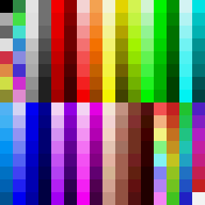
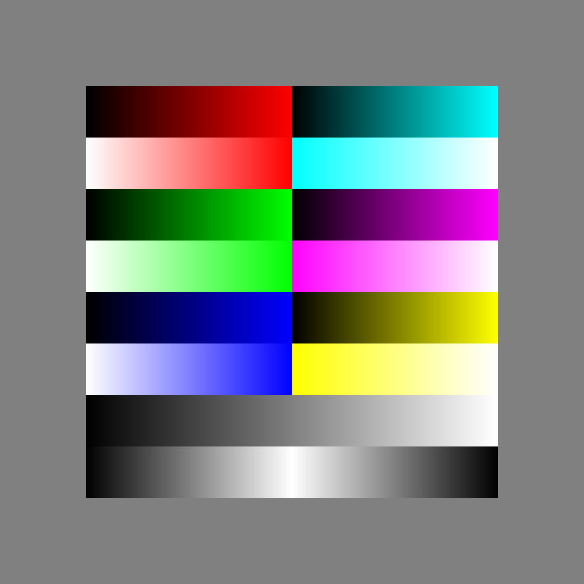

# Single header GIF encoder

Chris Lomont 2024 (code older, getting around to putting on github)

Contains 

* single header, small **GIF encoder**
* single header, small and good **color quantizer**, useful to pick nice palette for RGBA8 image for use in GIFs
* single header, small and good **image dithering**

NOTE: this now has proper LZW compression for small GIFs as the default. If you want to use less memory, but larger GIFs (say for embedded items), set the option before calling Start. The low memory options uses a nice trick of the LZW format to make encoding use very tiny memory footprint compared to other GIF encoders, which in turn means poor compression.

The encode has default internal palette (which can be overridden)

Demo program takes this 24-bit PNG (size 9kb)

to variations of quantized, palette optimized 50 frame GIFs. Examples

Palette optimized, dithered:

Internal palette from above, dithered

Palette optimized, no dither

Internal from above palette, no dither

END OF FILE